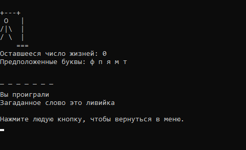

# Hangman



[Техническое задание](https://zhukovsd.github.io/java-backend-learning-course/projects/hangman/)

## Локальный запуск

```bash
git clone git@github.com:BamblooV/Hangman.git
cd Hangman
```

## Билд

```bash
./bin/Release/net8.0/Hangman.exe
```